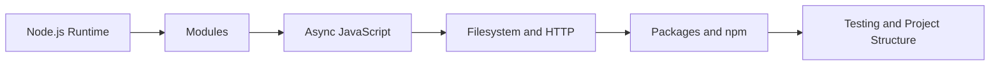

# 🟢 My First Node.js Project

[](https://nodejs.org/)
[](#learning-scope)
[](#project-status)

An introductory Node.js repository for learning server-side JavaScript, runtime fundamentals, modules, asynchronous programming, and small backend applications.

> This repository is preserved as a learning project. Review the current source files and dependency configuration before running or reusing the code.

## Project Overview

Node.js allows JavaScript to run outside the browser and is widely used for command-line tools, web servers, APIs, automation, and real-time applications. This repository provides a practical space for studying those foundations through code.

## Learning Scope

The repository may be used to practise:

- Running JavaScript with the Node.js runtime
- Working with built-in modules
- Importing and exporting modules
- Reading command-line arguments and environment variables
- Using callbacks, promises, and `async`/`await`
- Handling files and directories
- Creating basic HTTP services
- Understanding errors and process lifecycle
- Organizing a small Node.js project

## Prerequisites

- A current Node.js LTS release
- npm, included with Node.js
- Git
- A code editor such as Visual Studio Code

Check installed versions:

```bash
node --version
npm --version
```

## Getting Started

```bash
git clone https://github.com/PhuminDecOKnoi/my-first-node.js.git
cd my-first-node.js
```

Next, inspect the repository for `package.json` and the available entry file before running the project.

When a `package.json` file is present:

```bash
npm install
npm run
```

For a standalone JavaScript entry file:

```bash
node <entry-file>.js
```

## Recommended Project Standards

When extending this repository, apply the following baseline:

- Keep secrets in environment variables, not source files
- Validate all external input
- Handle rejected promises and runtime errors explicitly
- Use clear module boundaries
- Add scripts to `package.json`
- Pin and review dependencies
- Add formatting, linting, and automated tests
- Document the exact startup command

## Suggested Learning Path



## Project Status

This is an educational repository and may contain experiments from different stages of learning. It should not be treated as production-ready without a code, dependency, security, and configuration review.

## Intended Audience

- Beginner Node.js learners
- JavaScript developers moving to backend development
- Students studying server-side programming
- Instructors looking for an introductory Node.js code archive

## Search Topics

`nodejs` · `javascript` · `backend-development` · `server-side-javascript` · `async-await` · `npm` · `http-server` · `beginner-project` · `programming-education`

## License

Check the repository files for the currently applicable license before reuse or redistribution.

## Author

**Phumin Decoknoi**  
GitHub: [@PhuminDecOKnoi](https://github.com/PhuminDecOKnoi)

---

> Build understanding progressively: run the code, observe the output, change one concept at a time, and document what you learn.
